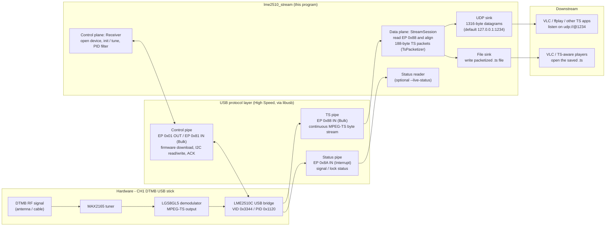

# 第一波道 DTMB USB 电视棒用户态客户端（CH1_DTMB_RE C++17 Port）

Cross-platform C++17 program that drives a CH1 DTMB receiver (LME2510C USB
bridge, VID/PID `0x3344` / `0x1120`, LGS8GL5 demodulator, MAX2165 tuner) and
forwards the demodulated MPEG-TS stream over UDP, raw UDP, and/or a `.ts` file.
Firmware blobs extracted from the original Windows driver are embedded into the
executable at build time.



## Supported hardware

- CH1 DTMB stick with LME2510C bridge firmware.
- Demodulator: Legend Silicon LGS8GL5.
- Tuner: Maxim MAX2165.
- TS output endpoint: EP `0x88`.

Protocol reference: [LME2510_Analysis.md](LME2510_Analysis.md).

## Build

### macOS

```sh
brew install libusb pkg-config cmake
cmake -S . -B build
cmake --build build
```

USB access on macOS normally requires root:

```sh
sudo ./build/lme2510_stream --freq 618 --no-udp --file out.ts --seconds 10
```

### Linux

```sh
sudo apt install cmake build-essential pkg-config libusb-1.0-0-dev
cmake -S . -B build
cmake --build build
```

If the device is not readable by your user, install a udev rule or run with
`sudo`.  A minimal rule is:

```
SUBSYSTEM=="usb", ATTR{idVendor}=="3344", ATTR{idProduct}=="1120", MODE="0666"
```

### Windows

Install [vcpkg](https://vcpkg.io), libusb, and CMake, then configure with the
vcpkg toolchain:

```powershell
vcpkg install libusb:x64-windows
cmake -S . -B build -A x64 `
  -DCMAKE_TOOLCHAIN_FILE="$env:VCPKG_INSTALLATION_ROOT/scripts/buildsystems/vcpkg.cmake"
cmake --build build --config Release
```

Use [Zadig](https://zadig.akeo.ie) to replace the stock Windows driver for the
device (VID/PID `0x3344` / `0x1120`) with WinUSB or libusbK.  Run:

```powershell
.\build\Release\lme2510_stream.exe --freq 618 --no-udp --file out.ts --seconds 10
```

### Windows XP (32-bit)

GitHub Actions has no Windows XP runners, so the XP artifact is
cross-compiled on Linux with an i686 MinGW-w64 toolchain (see
`.github/workflows/ci.yml`).  The workflow pins libusb to **1.0.23**, the last
release that still supported Windows XP, and links the compiler runtime
statically so the resulting `.exe` has no extra DLL dependencies.

To build an XP artifact locally on Ubuntu 22.04:

```sh
sudo apt-get install g++-mingw-w64-i686-posix libusb-1.0-0-dev pkg-config

ROOT="$PWD"
XP_PREFIX="$ROOT/build/xp-libusb-prefix"

# 1. Build a host-native copy of the firmware generator.
cmake -S . -B build/host-gen -DCMAKE_BUILD_TYPE=Release
cmake --build build/host-gen --target gen_firmware_embed

# 2. Build the last XP-capable libusb release for i686 Windows.
cd "$(mktemp -d)"
curl -fL -O https://github.com/libusb/libusb/releases/download/v1.0.23/libusb-1.0.23.tar.bz2
tar -xjf libusb-1.0.23.tar.bz2
cd libusb-1.0.23
./configure --host=i686-w64-mingw32 --prefix="$XP_PREFIX" \
  --enable-static --disable-shared --disable-udev \
  CFLAGS="-O2 -D_WIN32_WINNT=0x0501 -DWINVER=0x0501"
make -C libusb -j"$(nproc)"
make -C libusb install
cd "$ROOT"

# 3. Configure and build the XP binary.
cmake -S . -B build/xp \
  -DCMAKE_TOOLCHAIN_FILE="$PWD/cmake/mingw-i686-xp-toolchain.cmake" \
  -DLME2510_HOST_GEN_FIRMWARE_EMBED="$PWD/build/host-gen/gen_firmware_embed" \
  -DLIBUSB_INCLUDE_DIR="$XP_PREFIX/include/libusb-1.0" \
  -DLIBUSB_LIBRARY="$XP_PREFIX/lib/libusb-1.0.a"
cmake --build build/xp
```

Windows XP notes:

- Windows XP is normally 32-bit, so use the x86 artifact
  (`lme2510_stream-xp-x86.exe`).
- Microsoft's WinUSB is only available from Vista onwards.  On XP, replace the
  stock driver with a **libusb-win32** or **libusbK** driver; old
  [Zadig 2.2](https://github.com/pbatard/libwdi/releases/download/v1.2.5/zadig_xp-2.2.exe) is the
  version that still supports XP.

## Usage

```text
lme2510_stream [options]

  --freq MHz            tune frequency in MHz (default 618)
  --pids LIST           comma-separated PID allow-list, e.g. 0x0100,0x0101
  --pid-mode N          CMD 0x03 mode (0 = allow-list, 2 = clear/advanced)
  --udp HOST:PORT       UDP target (default 127.0.0.1:1234)
  --raw-udp HOST:PORT   send raw EP 0x88 bulk frames unchanged
  --no-udp              disable UDP
  --file PATH           write packetized TS to PATH
  --seconds N           stop after N seconds (default: until Ctrl-C)
  --telemetry N         register snapshot interval in seconds (0 disables)
  --live-status         read EP 0x8A on a background thread while streaming
  --status-log PATH     status/statistics log (default logs/stream-<time>.log)
  --reg-log PATH        register-operation log (default logs/regs-<time>.log)
  --usb-trace           include raw USB packets in the register log
  --fw1 PATH            override embedded stage-1 firmware
  --fw2 PATH            override embedded stage-2 firmware
```

Examples:

```sh
# TS to UDP 127.0.0.1:1234 (default)
sudo ./build/lme2510_stream --freq 618

# Raw EP 0x88 frames to a separate diagnostic port
sudo ./build/lme2510_stream --freq 618 --raw-udp 127.0.0.1:1235

# Ten seconds of PID-filtered 554 MHz into a file, no UDP
sudo ./build/lme2510_stream --freq 554 --pids 0x0100,0x0101 --no-udp \
  --file ts554.ts --seconds 10 --reg-log logs/regs-554.log
```

Play the UDP stream in VLC with `udp://@1234`.  File captures are standard
188-byte MPEG-TS and can be played by any TS-aware player.

## Releases

Pushing a tag starting with `v` (for example `v1.0.0`) triggers
`.github/workflows/release.yml`, which builds Linux x64, macOS, Windows x64 and
Windows XP x86 binaries and attaches them to a GitHub Release together with a
`SHA256SUMS.txt` checksum file:

```sh
git tag v1.0.0
git push origin v1.0.0
```

Every push/PR also runs `.github/workflows/ci.yml`; the XP binary can be
downloaded from the workflow run's artifact list (artifacts expire after some
days, so use a tag for permanent binaries).

## Compatibility notes

- Full Speed USB devices use a different TS stream endpoint than EP `0x88` and
  are intentionally rejected/unsupported in this version.
- The LGS8G75 branch in the protocol/initialization code has not been validated
  against hardware in this port and is not claimed as supported.
- Firmware download searches for cold-boot PID `0x1111` before the stage-1
  firmware is loaded; that PID is only a transient boot state, not a supported
  device identity.

## Acknowledgements

- [Linux Kernel Driver for LME2510C](https://github.com/torvalds/linux/blob/master/drivers/media/usb/dvb-usb-v2/lmedm04.c)
- [LeDTMB](https://github.com/IcingTomato/LeDTMB): Client for a rather simple DTMB receiver.
- [libusb](https://libusb.info/): Library for USB device access in userspace.
