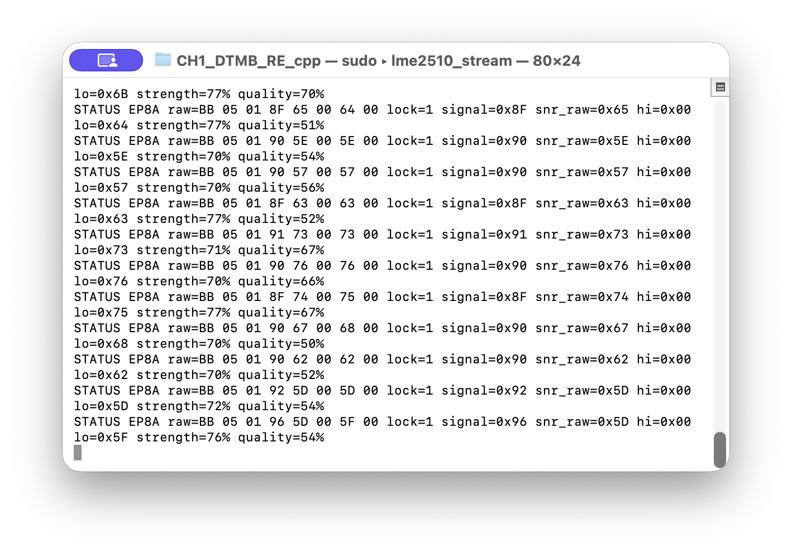
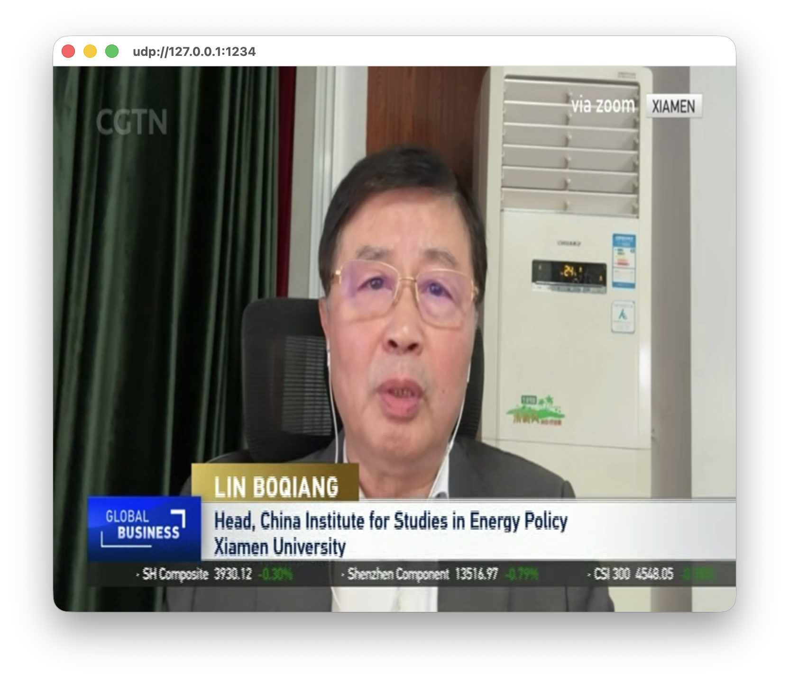
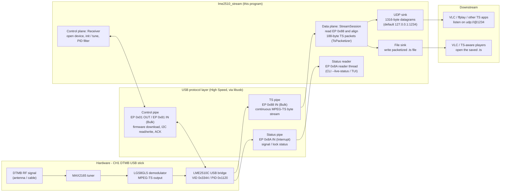

# 第一波道 DTMB USB 电视棒用户态客户端（CH1_DTMB_RE C++17 Port）

<div align="center">
  
  
</div>


Cross-platform C++17 program that drives a CH1 DTMB receiver (LME2510C USB
bridge, VID/PID `0x3344` / `0x1120`, LGS8GL5 demodulator, MAX2165 tuner) and
forwards the demodulated MPEG-TS stream over UDP, raw UDP, and/or a `.ts` file.
Firmware blobs extracted from the original Windows driver are embedded into the
executable at build time.



## Supported hardware

- CH1 DTMB stick with LME2510C bridge firmware.
- Demodulator: Legend Silicon LGS8GL5.
- Tuner: Maxim MAX2165.
- TS output endpoint: EP `0x88`.

Protocol reference: [LME2510_Analysis.md](LME2510_Analysis.md).

## Building from source

Dependency install, CMake configuration, and cross-compilation instructions
live in [BUILD.md](BUILD.md).

## Usage

```text
lme2510_stream [options]

  --freq MHz            tune frequency in MHz (default 618)
  --pids LIST           comma-separated PID allow-list, e.g. 0x0100,0x0101
  --pid-mode N          CMD 0x03 mode (0 = allow-list, 2 = clear/advanced)
  --udp HOST:PORT       UDP target (default 127.0.0.1:1234)
  --raw-udp HOST:PORT   send raw EP 0x88 bulk frames unchanged
  --no-udp              disable UDP
  --file PATH           write packetized TS to PATH
  --seconds N           stop after N seconds (default: until Ctrl-C)
  --telemetry N         register snapshot interval in seconds (0 disables)
  --live-status         read EP 0x8A on a background thread while streaming
  --status-log PATH     status/statistics log (default logs/stream-<time>.log)
  --reg-log PATH        register-operation log (default logs/regs-<time>.log)
  --usb-trace           include raw USB packets in the register log
  --tui                 full-screen FTXUI UI (macOS/Linux, Windows MSVC)
  --fw1 PATH            override embedded stage-1 firmware
  --fw2 PATH            override embedded stage-2 firmware
```

Examples:

```sh
# TS to UDP 127.0.0.1:1234 (default)
sudo ./build/lme2510_stream --freq 618

# Interactive TUI: pick a frequency, watch signal, then stream/record
sudo ./build/lme2510_stream --tui

# Raw EP 0x88 frames to a separate diagnostic port
sudo ./build/lme2510_stream --freq 618 --raw-udp 127.0.0.1:1235

# Ten seconds of PID-filtered 554 MHz into a file, no UDP
sudo ./build/lme2510_stream --freq 554 --pids 0x0100,0x0101 --no-udp \
  --file ts554.ts --seconds 10 --reg-log logs/regs-554.log
```

Play the UDP stream in VLC with `udp://@1234`.  File captures are standard
188-byte MPEG-TS and can be played by any TS-aware player.

### TUI (`--tui`)

The optional full-screen FTXUI interface has four pages (`1`/`2`/`3`/`4`):

- `[1 频率页]` — walk the Chinese DTMB UHF grid (474–858 MHz in 8 MHz steps),
  mark frequencies with `Space`, toggle all with `A`, scan the marked set with
  `S`, and tune a row with `Enter`.  Live signal rows appear at the bottom
  while monitoring.
- `[2 控制台]` — entered automatically after tuning.  The left column lists the
  services parsed from PAT/PMT/SDT; the right pane toggles between output
  control and service detail with `Tab`.  `Space` toggles UDP streaming, `R`
  toggles file recording, `Enter` selects the highlighted service (streaming
  and recording then PID-filter that service), `C` clears back to the whole
  multiplex, and `E` opens the EPG page for the highlighted service.
- `[3 节目单]` — EPG of the selected service, decoded from EIT.  Service names
  come from SDT and event names from EIT; Chinese DTMB text is GB2312 and is
  decoded to UTF-8 with a built-in table, so no iconv dependency is needed.
  `↑/↓` and `PgUp/PgDn` scroll the list, and `[` / `]` switch to the previous
  or next service.
- `[4 调试]` — tails the `--reg-log` file (CTRL/I2C commands sent to the
  stick).

The bottom rows show live EP 0x8A signal strength/quality bars and lock state,
TS bit rate, register telemetry, and CC/resync/dropped-byte counters.  When no
status packet has arrived yet they show `--` plus a running timeout counter
("已读取 N 次超时"), so a silent EP 0x8A endpoint is distinguishable from one
that is actively being read.

If no `--file` target is supplied, recording creates `record-<unix-time>.ts`
in the current directory.

`--tui` is built by default on macOS/Linux and on modern Windows when compiled
with MSVC (FTXUI v7; CMake fetches it automatically when it is not installed).
MinGW/Windows-XP builds keep the CLI behaviour and print an error if `--tui`
is requested.

### Platform access

#### macOS

USB access on macOS normally requires root:

```sh
sudo ./build/lme2510_stream --freq 618 --no-udp --file out.ts --seconds 10
```

#### Linux

If the device is not readable by your user, install a udev rule or run with
`sudo`.  A minimal rule is:

```
SUBSYSTEM=="usb", ATTR{idVendor}=="3344", ATTR{idProduct}=="1120", MODE="0666"
```

#### Android / Termux

Termux users can download the pre-built aarch64 binary from
[Releases](https://github.com/xeonliu/CH1_DTMB_RE_cpp/releases); building from
source is documented in [BUILD.md](BUILD.md):

```sh
pkg install libusb termux-api
curl -fLO https://github.com/xeonliu/CH1_DTMB_RE_cpp/releases/latest/download/lme2510_stream-termux-aarch64
chmod +x lme2510_stream-termux-aarch64
```

Non-rooted Android cannot open USB devices directly.  With the [Termux:API](
https://wiki.termux.com/wiki/Termux:API) plugin installed and the stick on an
OTG adapter, list the device, then run under `termux-usb` so libusb receives
the Android USB file descriptor (the API plugin asks for USB permission on
first use):

```sh
termux-usb -l                                  # e.g. /dev/bus/usb/001/002
termux-usb -r -E -e \
  "./lme2510_stream-termux-aarch64 --freq 618 --no-udp --file out.ts --seconds 10" \
  /dev/bus/usb/001/002
```

Termux's libusb understands the `-E` flag (it exports `TERMUX_USB_FD`), so no
wrapper code is required.  Rooted devices can instead run the binary directly
with `sudo`.  Keep Termux packages updated after major Termux upgrades
(`pkg upgrade`), and verify sustained TS throughput on the actual device.

#### Windows

Use [Zadig](https://zadig.akeo.ie) to replace the stock Windows driver for the
device (VID/PID `0x3344` / `0x1120`) with WinUSB or libusbK.  Run:

```powershell
.\build\Release\lme2510_stream.exe --freq 618 --no-udp --file out.ts --seconds 10
```

The x64 MSVC build also supports the interactive TUI (`--tui`); run it from a
terminal that supports VT/ANSI output (Windows 10+ console or Windows
Terminal).

#### Windows XP

- Windows XP is normally 32-bit, so use the x86 artifact
  (`lme2510_stream-xp-x86.exe`).
- Microsoft's WinUSB is only available from Vista onwards.  On XP, replace the
  stock driver with a **libusb-win32** or **libusbK** driver; old
  [Zadig 2.2](https://github.com/pbatard/libwdi/releases/download/v1.2.5/zadig_xp-2.2.exe) is the
  version that still supports XP.

## Compatibility notes

- Full Speed USB devices use a different TS stream endpoint than EP `0x88` and
  are intentionally rejected/unsupported in this version.
- The LGS8G75 branch in the protocol/initialization code has not been validated
  against hardware in this port and is not claimed as supported.
- Firmware download searches for cold-boot PID `0x1111` before the stage-1
  firmware is loaded; that PID is only a transient boot state, not a supported
  device identity.

## Acknowledgements

- [Linux Kernel Driver for LME2510C](https://github.com/torvalds/linux/blob/master/drivers/media/usb/dvb-usb-v2/lmedm04.c)
- [LeDTMB](https://github.com/IcingTomato/LeDTMB): Client for a rather simple DTMB receiver.
- [libusb](https://libusb.info/): Library for USB device access in userspace.
